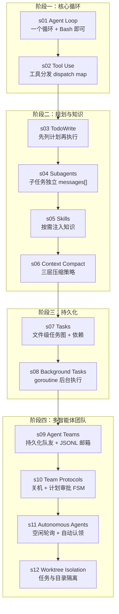

# Learn Claude Code — Go 实现版


> **本仓库是 [shareAI-lab/learn-claude-code](https://github.com/shareAI-lab/learn-claude-code) 的 Go 语言重新实现。**

原项目使用 Python 从零构建了一个 nano Claude Code 风格的 AI Agent，分 12 个渐进式 Session 讲解 Agent 的核心机制。本仓库的目标是用 **Go** 完整复刻这 12 个 Session，保持相同的学习路径与设计思路，同时发挥 Go 在并发、类型安全和部署便携性上的优势。

**与原版的关键差异：**
- 模型：使用 **阿里通义千问**（Qwen）系列模型，而非 Claude
- API：通义千问提供 **兼容 OpenAI 的 RESTful API**，无需适配额外协议
- SDK：使用官方 **`github.com/openai/openai-go`** Go SDK 直接调用

---

## 目录

- [原项目简介](#原项目简介)
- [学习路径](#学习路径)
- [目录结构](#目录结构)
- [快速开始](#快速开始)
- [与原 Python 版本的对应关系](#与原-python-版本的对应关系)
- [常见问题 FAQ](#常见问题-faq)
- [贡献指南](#贡献指南)
- [参考资料](#参考资料)

---

## 原项目简介

```
                THE AGENT PATTERN
                =================

User --> messages[] --> LLM --> response
                                  |
                        stop_reason == "tool_use"?
                       /                          \
                     yes                           no
                      |                             |
                execute tools                    return text
                append results
                loop back -----------------> messages[]
```

---

## 学习路径



12 个 Session，每个 Session 在同一个循环上叠加一个机制：

| Session | 主题 | 格言 | Go 实现要点 |
|---------|------|------|-------------|
| s01 | Agent Loop | *One loop & Bash is all you need* | `for` 循环 + `exec.Command` 执行 Bash |
| s02 | Tool Use | *Adding a tool means adding one handler* | `map[string]ToolHandler` 分发，接口统一注册 |
| s03 | TodoWrite | *An agent without a plan drifts* | 结构体序列化为 JSON，文件原子写入 |
| s04 | Subagents | *Break big tasks down; each subtask gets a clean context* | 每个子 Agent 独立 `[]Message`，函数调用隔离 |
| s05 | Skills | *Load knowledge when you need it, not upfront* | `os.ReadFile` 按需读取 SKILL.md，注入 `tool_result` |
| s06 | Context Compact | *Context will fill up; you need a way to make room* | 三层压缩：截断 → 摘要 → 滚动窗口 |
| s07 | Tasks | *Break big goals into small tasks, order them, persist to disk* | JSON 文件 CRUD + 拓扑排序依赖图 |
| s08 | Background Tasks | *Run slow operations in the background; the agent keeps thinking* | `goroutine` 后台运行，`channel` 注入完成通知 |
| s09 | Agent Teams | *When the task is too big for one, delegate to teammates* | 多 goroutine 队友 + JSONL 文件邮箱 |
| s10 | Team Protocols | *Teammates need shared communication rules* | 有限状态机（FSM）驱动关机与计划审批 |
| s11 | Autonomous Agents | *Teammates scan the board and claim tasks themselves* | 空闲轮询 ticker + 原子 CAS 认领任务 |
| s12 | Worktree Isolation | *Each works in its own directory, no interference* | `git worktree` + 任务 ID 绑定独立工作目录 |

---

## 目录结构

```
Learn-Claude-Code/
├── agents/
│   ├── s01_agent_loop/
│   ├── s02_tool_use/
│   ├── s03_todo_write/
│   ├── s04_subagent/
│   ├── s05_skill_loading/
│   ├── s06_context_compact/
│   ├── s07_task_system/
│   ├── s08_background_tasks/
│   ├── s09_agent_teams/
│   ├── s10_team_protocols/
│   ├── s11_autonomous_agents/
│   └── s12_worktree_isolation/
├── pkg/
│   ├── qwen/           # 通义千问 OpenAI 兼容客户端封装
│   ├── tools/          # 工具注册与分发
│   └── loop/           # 核心 Agent 循环
├── .env.example
├── go.mod
├── go.sum
└── README.md
```

---

## 快速开始

```bash
git clone https://github.com/nickdu/Learn-Claude-Code
cd Learn-Claude-Code

# 安装依赖
go mod tidy

# 配置环境变量
cp .env.example .env
# 编辑 .env，按需填写以下变量：
#   DASHSCOPE_API_KEY=sk-xxxx                                              # 必填
#   DASHSCOPE_BASE_URL=https://dashscope.aliyuncs.com/compatible-mode/v1  # 必填
#   DASHSCOPE_MODEL=qwen-plus                                              # 可选，默认 qwen-plus

# 运行第一个 Session
go run ./agents/s01_agent_loop/
```

> **前置依赖：** Go 1.22+，[阿里云灵积平台](https://dashscope.aliyun.com/) API Key。

---

## 与原 Python 版本的对应关系

| 维度 | Python 原版 | Go 实现版 |
|------|-------------|-----------|
| 语言 | Python 3.x | Go 1.22+ |
| 模型 | Claude (Anthropic) | 通义千问 Qwen（阿里云） |
| API 协议 | Anthropic Messages API | OpenAI 兼容 RESTful API |
| SDK | `anthropic` Python SDK | `github.com/openai/openai-go` |
| 并发模型 | `threading.Thread` | `goroutine` + `channel` |
| 任务持久化 | JSON 文件 | JSON 文件（保持一致） |
| 部署 | 需要 Python 环境 | 单一静态二进制 |

### 环境变量说明

| 变量名 | 必填 | 默认值 | 说明 |
|--------|------|--------|------|
| `DASHSCOPE_API_KEY` | ✅ | — | 阿里云灵积平台 API Key |
| `DASHSCOPE_BASE_URL` | ✅ | — | `https://dashscope.aliyuncs.com/compatible-mode/v1` |
| `DASHSCOPE_MODEL` | ❌ | `qwen-plus` | 模型名称，可选值见下表 |

**可选模型：**

| 模型名 | 特点 |
|--------|------|
| `qwen-turbo` | 速度最快，成本最低，适合简单任务 |
| `qwen-plus` | 均衡性能，推荐日常使用（默认） |
| `qwen-max` | 最强推理能力，适合复杂 Agent 任务 |
| `qwen-long` | 超长上下文，适合 s06 Context Compact 等场景 |

### 通义千问 OpenAI 兼容接入示例

```go
import "github.com/openai/openai-go"

model := os.Getenv("DASHSCOPE_MODEL")
if model == "" {
    model = "qwen-plus"
}

client := openai.NewClient(
    option.WithAPIKey(os.Getenv("DASHSCOPE_API_KEY")),
    option.WithBaseURL(os.Getenv("DASHSCOPE_BASE_URL")),
)

resp, err := client.Chat.Completions.New(ctx, openai.ChatCompletionNewParams{
    Model:    openai.F(model),
    Messages: openai.F(messages),
    Tools:    openai.F(tools),
})
```

> 通义千问兼容 OpenAI 的 `tool_calls` / `function_calling` 协议，Agent 循环的核心逻辑无需改动。

---

## 常见问题 FAQ

**Q：如何申请通义千问 API Key？**

1. 访问 [阿里云灵积平台](https://dashscope.aliyun.com/)，注册/登录阿里云账号
2. 进入「API-KEY 管理」，点击「创建新的 API-KEY」
3. 将生成的 Key 填入 `.env` 文件的 `DASHSCOPE_API_KEY`

---

**Q：通义千问的 `tool_calls` 与 OpenAI 完全兼容吗？**

基本兼容。通义千问支持 OpenAI 的 `tools` 参数格式和 `tool_calls` 响应格式，`finish_reason` 为 `tool_calls` 时触发工具调用，与原版 Agent 循环中 `stop_reason == "tool_use"` 的逻辑对应。

> 注意：`qwen-turbo` 对复杂并行工具调用的支持弱于 `qwen-max`，建议从 s02 开始使用 `qwen-plus` 或以上。

---

**Q：运行时报 `invalid_api_key` 错误？**

检查以下几点：
- `.env` 文件是否已正确创建（`cp .env.example .env`）
- `DASHSCOPE_API_KEY` 是否以 `sk-` 开头且未包含多余空格
- 程序是否正确加载了 `.env`（推荐使用 `github.com/joho/godotenv`）

---

**Q：`DASHSCOPE_BASE_URL` 可以不设置吗？**

不可以。`openai-go` SDK 默认指向 OpenAI 官方端点，必须通过 `DASHSCOPE_BASE_URL` 覆盖为通义千问的兼容地址。

---

**Q：如何切换模型进行对比测试？**

```bash
DASHSCOPE_MODEL=qwen-max go run ./agents/s01_agent_loop/
DASHSCOPE_MODEL=qwen-turbo go run ./agents/s01_agent_loop/
```

或直接修改 `.env` 中的 `DASHSCOPE_MODEL`。

---

## 贡献指南

欢迎提交 PR 和 Issue！请遵循以下规范：

### 分支命名

```
feat/s01-agent-loop      # 新增 Session 实现
fix/s03-todo-write       # 修复某 Session 的 Bug
docs/update-readme       # 文档更新
refactor/pkg-tools       # 重构公共包
```

### 每个 Session 的实现规范

1. **独立目录**：每个 Session 放在 `agents/sXX_name/` 下，包含独立的 `main.go`
2. **复用公共包**：API 客户端、工具注册等通用逻辑抽取到 `pkg/` 下，避免重复
3. **保持最小化**：每个 Session 只新增该 Session 对应的一个机制，不超前引入后续概念
4. **注释语言**：标准库使用英文注释，复杂业务逻辑使用中文注释
5. **错误处理**：所有错误必须显式处理，禁止 `_` 忽略关键错误

### 提交信息格式

```
feat(s01): implement basic agent loop with bash tool
fix(s03): fix todo file not flushed on concurrent write
docs: add FAQ for API key setup
```

### 提交 PR 前

- [ ] `go vet ./...` 无警告
- [ ] `go build ./...` 编译通过
- [ ] 在本地用真实 API Key 跑通对应 Session

---

## 参考资料

- 原仓库：[shareAI-lab/learn-claude-code](https://github.com/shareAI-lab/learn-claude-code)
- 在线文档：[learn-claude-agents.vercel.app](https://learn-claude-agents.vercel.app/en/s01/)
- 通义千问 OpenAI 兼容文档：[help.aliyun.com — 兼容 OpenAI 接口](https://help.aliyun.com/zh/model-studio/developer-reference/compatibility-of-openai-with-dashscope)
- openai-go SDK：[github.com/openai/openai-go](https://github.com/openai/openai-go)
- 阿里云灵积平台：[dashscope.aliyun.com](https://dashscope.aliyun.com/)

---

## License

MIT
